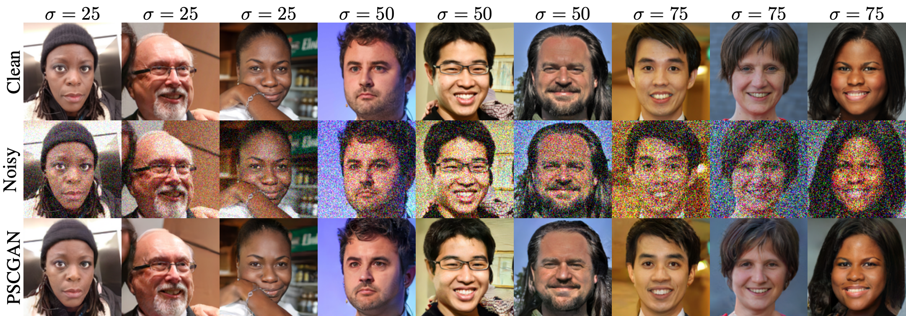

---

##### Links

+ [Paper PDF](pscgan-main.pdf)
+ [Supplementary PDF](pscgan-supp.pdf)


---

##### Abstract

The vast work in Deep Learning (DL) has led to a leap in image denoising research. Most DL solutions for this task have chosen to put their efforts on the denoiser's architecture while maximizing distortion performance. However, distortion driven solutions lead to blurry results with sub-optimal perceptual quality, especially in immoderate noise levels. In this paper we propose a different perspective, aiming to produce sharp and visually pleasing denoised images that are still faithful to their clean sources. Formally, our goal is to achieve high perceptual quality with acceptable distortion. This is attained by a stochastic denoiser that samples from the posterior distribution, trained as a generator in the framework of conditional generative adversarial networks (CGAN). Contrary to distortion-based regularization terms that conflict with perceptual quality, we introduce to the CGAN objective a theoretically founded penalty term that does not force a distortion requirement on individual samples, but rather on their mean. We showcase our proposed method with a novel denoiser architecture that achieves the reformed denoising goal and produces vivid and diverse outcomes in immoderate noise levels.

---

##### Visual results



---

##### Citation

```BibTeX
@InProceedings{Ohayon_2021_ICCV,
    author    = {Ohayon, Guy and Adrai, Theo and Vaksman, Gregory and Elad, Michael and Milanfar, Peyman},
    title     = {High Perceptual Quality Image Denoising With a Posterior Sampling CGAN},
    booktitle = {Proceedings of the IEEE/CVF International Conference on Computer Vision (ICCV) Workshops},
    month     = {October},
    year      = {2021},
    pages     = {1805-1813}
}
```