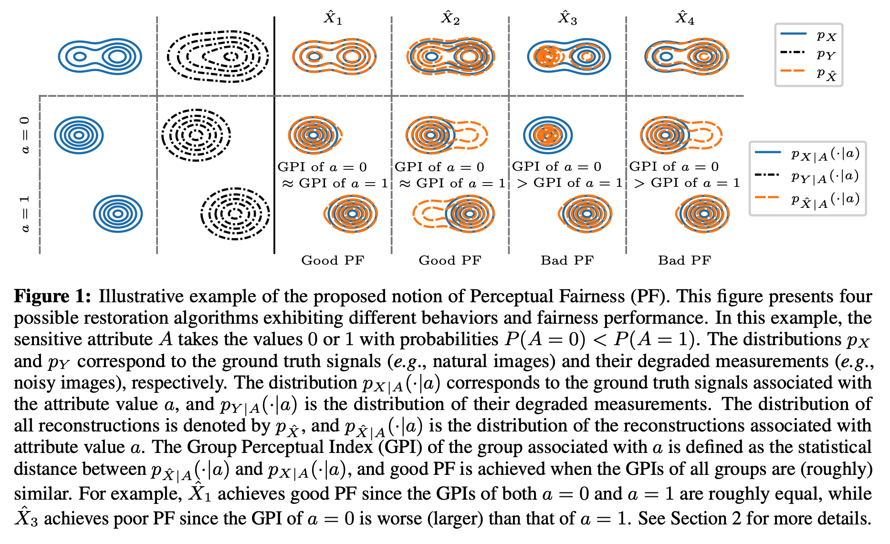

##### Abstract

Fairness in image restoration tasks is the desire to treat different sub-groups of images equally well. Existing definitions of fairness in image restoration are highly restrictive. They consider a reconstruction to be a correct outcome for a group (e.g., women) only if it falls within the group’s set of ground truth images (e.g., natural images of women); otherwise, it is considered entirely incorrect. Consequently, such definitions are prone to controversy, as errors in image restoration can manifest in various ways. In this work we offer an alternative approach towards fairness in image restoration, by considering the Group Perceptual Index (GPI), which we define as the statistical distance between the distribution of the group’s ground truth images and the distribution of their reconstructions. We assess the fairness of an algorithm by comparing the GPI of different groups, and say that it achieves perfect Perceptual Fairness (PF) if the GPIs of all groups are identical. We motivate and theoretically study our new notion of fairness, draw its connection to previous ones, and demonstrate its utility on state-of-the-art face image super-resolution algorithms.

---

##### Download

+ [You can find the paper here.](https://arxiv.org/pdf/2405.13805)
<!-- + [Online appendix](appendix2.pdf)
+ [Code and data](https://github.com/pmichaillat/unemployment-gap) -->

---

##### Qualitative illustration of the proposed notion of perceptual fairness



---
<!-- 
##### Citation

Author 1 and Author 2. Year. "Title." *Journal* Volume (Issue): First page–Last page. https://doi.org/paper_doi.

```BibTeX
@article{AAYY,
author = {Author 1 and Author 2},
doi = {paper_doi},
journal = {Journal},
number = {Issue},
pages = {XXX--YYY},
title ={Title},
volume = {Volume},
year = {Year}}
```

---

##### Related material

+ [Presentation slides](presentation2.pdf)
 -->
