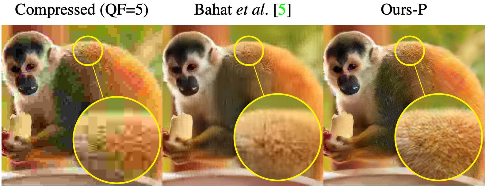

---

##### Links

+ [Paper PDF](sean-main.pdf)
+ [Supplementary PDF](sean-supp.pdf)


---

##### Abstract

JPEG is arguably the most popular image coding format, achieving high compression ratios via lossy quantization that may create visual artifacts degradation. Numerous attempts to remove these artifacts were conceived over the years, and common to most of these is the use of deterministic post-processing algorithms that optimize some distortion measure (e.g., PSNR, SSIM). In this paper we propose a different paradigm for JPEG artifact correction: Our method is stochastic, and the objective we target is high perceptual quality -- striving to obtain sharp, detailed and visually pleasing reconstructed images, while being consistent with the compressed input. These goals are achieved by training a stochastic conditional generator (conditioned on the compressed input), accompanied by a theoretically well-founded loss term, resulting in a sampler from the posterior distribution. Our solution offers a diverse set of plausible and fast reconstructions for a given input with perfect consistency. We demonstrate our scheme's unique properties and its superiority to a variety of alternative methods on the FFHQ and ImageNet datasets.

---

##### Visual comparison with a previous method



---

##### Citation

```BibTeX
@InProceedings{Man_2023_CVPR,
    author    = {Man, Sean and Ohayon, Guy and Adrai, Theo and Elad, Michael},
    title     = {High-Perceptual Quality JPEG Decoding via Posterior Sampling},
    booktitle = {Proceedings of the IEEE/CVF Conference on Computer Vision and Pattern Recognition (CVPR) Workshops},
    month     = {June},
    year      = {2023},
    pages     = {1272-1282}
}
```