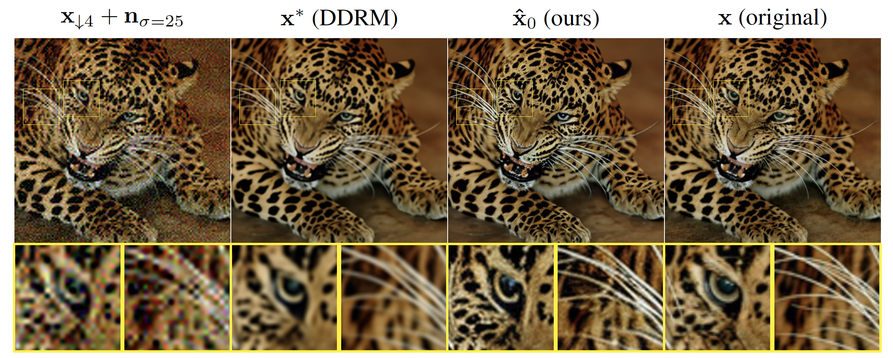

---

##### Links

+ [Paper PDF](dot.pdf)
+ [Code](https://github.com/theoad/dot-dmax/)

---

##### Abstract

We propose an image restoration algorithm that can control the perceptual quality and/or the mean square error (MSE) of any pre-trained model, trading one over the other at test time. Our algorithm is few-shot: Given about a dozen images restored by the model, it can significantly improve the perceptual quality and/or the MSE of the model for newly restored images without further training. Our approach is motivated by a recent theoretical result that links between the minimum MSE (MMSE) predictor and the predictor that minimizes the MSE under a perfect perceptual quality constraint. Specifically, it has been shown that the latter can be obtained by optimally transporting the output of the former, such that its distribution matches that of the source data. Thus, to improve the perceptual quality of a predictor that was originally trained to minimize MSE, we approximate the optimal transport by a linear transformation in the latent space of a variational auto-encoder, which we compute in closed-form using empirical means and covariances. Going beyond the theory, we find that applying the same procedure on models that were initially trained to achieve high perceptual quality, typically improves their perceptual quality even further. And by interpolating the results with the original output of the model, we can improve their MSE on the expense of perceptual quality. We illustrate our method on a variety of degradations applied to general content images with arbitrary dimensions.

---

##### Visual results, where we enhance the perceptual quality of DDRM



---

##### Citation

```BibTeX
@inproceedings{adrai2023dot,
 author = {Adrai, Theo and Ohayon, Guy and Elad, Michael and Michaeli, Tomer},
 booktitle = {Advances in Neural Information Processing Systems},
 editor = {A. Oh and T. Naumann and A. Globerson and K. Saenko and M. Hardt and S. Levine},
 pages = {61777--61791},
 publisher = {Curran Associates, Inc.},
 title = {Deep Optimal Transport: A Practical Algorithm for Photo-realistic Image Restoration},
 url = {https://proceedings.neurips.cc/paper_files/paper/2023/file/c281c5a17ad2e55e1ac1ca825071f991-Paper-Conference.pdf},
 volume = {36},
 year = {2023}
}
```