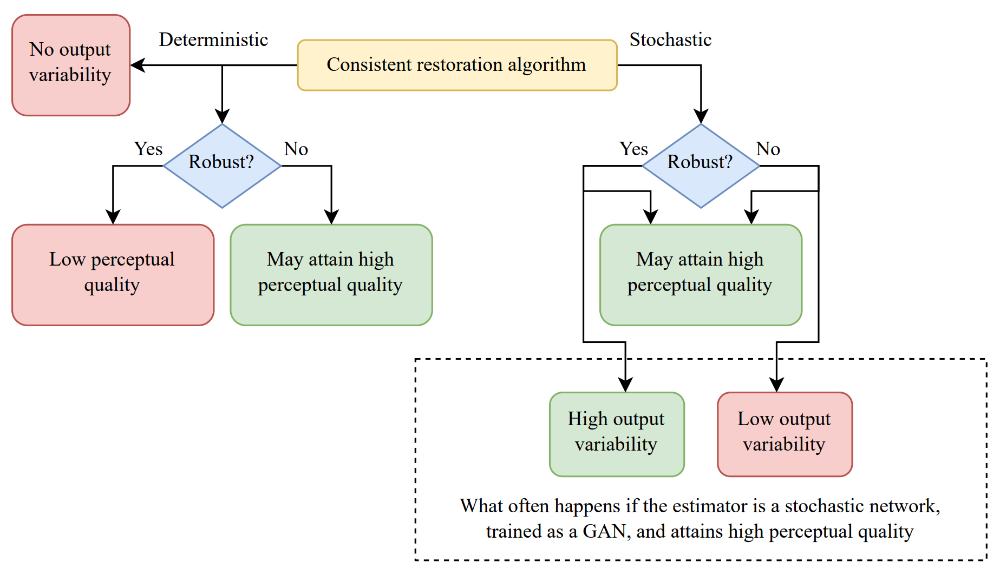

---

##### Links

+ [Paper PDF](reasons.pdf)
+ [Talk](https://www.youtube.com/watch?v=5WMEqkGPWq4&ab_channel=TAUVOD)


---

##### Abstract

Stochastic restoration algorithms allow to explore the space of solutions that correspond to the degraded input. In this paper we reveal additional fundamental advantages of stochastic methods over deterministic ones, which further motivate their use. First, we prove that any restoration algorithm that attains perfect perceptual quality and whose outputs are consistent with the input must be a posterior sampler, and is thus required to be stochastic. Second, we illustrate that while deterministic restoration algorithms may attain high perceptual quality, this can be achieved only by filling up the space of all possible source images using an extremely sensitive mapping, which makes them highly vulnerable to adversarial attacks. Indeed, we show that enforcing deterministic models to be robust to such attacks profoundly hinders their perceptual quality, while robustifying stochastic models hardly influences their perceptual quality, and improves their output variability. These findings provide a motivation to foster progress in stochastic restoration methods, paving the way to better recovery algorithms.

---

##### The take-home messages from our paper



---

##### Citation

```BibTeX
@InProceedings{pmlr-v202-ohayon23a,
  title = 	 {Reasons for the Superiority of Stochastic Estimators over Deterministic Ones: Robustness, Consistency and Perceptual Quality},
  author =       {Ohayon, Guy and Adrai, Theo Joseph and Elad, Michael and Michaeli, Tomer},
  booktitle = 	 {Proceedings of the 40th International Conference on Machine Learning},
  pages = 	 {26474--26494},
  year = 	 {2023},
  editor = 	 {Krause, Andreas and Brunskill, Emma and Cho, Kyunghyun and Engelhardt, Barbara and Sabato, Sivan and Scarlett, Jonathan},
  volume = 	 {202},
  series = 	 {Proceedings of Machine Learning Research},
  month = 	 {23--29 Jul},
  publisher =    {PMLR},
  pdf = 	 {https://proceedings.mlr.press/v202/ohayon23a/ohayon23a.pdf},
  url = 	 {https://proceedings.mlr.press/v202/ohayon23a.html},
  abstract = 	 {Stochastic restoration algorithms allow to explore the space of solutions that correspond to the degraded input. In this paper we reveal additional fundamental advantages of stochastic methods over deterministic ones, which further motivate their use. First, we prove that any restoration algorithm that attains perfect perceptual quality and whose outputs are consistent with the input must be a posterior sampler, and is thus required to be stochastic. Second, we illustrate that while deterministic restoration algorithms may attain high perceptual quality, this can be achieved only by filling up the space of all possible source images using an extremely sensitive mapping, which makes them highly vulnerable to adversarial attacks. Indeed, we show that enforcing deterministic models to be robust to such attacks profoundly hinders their perceptual quality, while robustifying stochastic models hardly influences their perceptual quality, and improves their output variability. These findings provide a motivation to foster progress in stochastic restoration methods, paving the way to better recovery algorithms.}
}

```