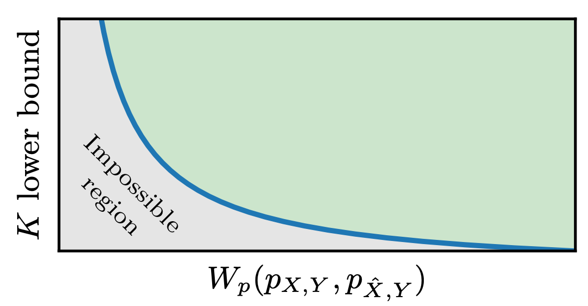

---

##### Links

+ [Paper PDF](pr-tradeoff.pdf)

---

##### Abstract

We study the behavior of deterministic methods for solving inverse problems in imaging. These methods are commonly designed to achieve two goals: (1) attaining high perceptual quality, and (2) generating reconstructions that are consistent with the measurements. We provide a rigorous proof that the better a predictor satisfies these two requirements, the larger its Lipschitz constant must be, regardless of the nature of the degradation involved. In particular, to approach perfect perceptual quality and perfect consistency, the Lipschitz constant of the model must grow to infinity. This implies that such methods are necessarily more susceptible to adversarial attacks. We demonstrate our theory on single image super-resolution algorithms, addressing both noisy and noiseless settings. We also show how this undesired behavior can be leveraged to explore the posterior distribution, thereby allowing the deterministic model to imitate stochastic methods.

---

##### Qualitative illustration of the perception-robustness tradeoff



---

##### Citation

```BibTeX

@InProceedings{pmlr-v235-ohayon24a,
  title = 	 {The Perception-Robustness Tradeoff in Deterministic Image Restoration},
  author =       {Ohayon, Guy and Michaeli, Tomer and Elad, Michael},
  booktitle = 	 {Proceedings of the 41st International Conference on Machine Learning},
  pages = 	 {38599--38638},
  year = 	 {2024},
  editor = 	 {Salakhutdinov, Ruslan and Kolter, Zico and Heller, Katherine and Weller, Adrian and Oliver, Nuria and Scarlett, Jonathan and Berkenkamp, Felix},
  volume = 	 {235},
  series = 	 {Proceedings of Machine Learning Research},
  month = 	 {21--27 Jul},
  publisher =    {PMLR},
  pdf = 	 {https://raw.githubusercontent.com/mlresearch/v235/main/assets/ohayon24a/ohayon24a.pdf},
  url = 	 {https://proceedings.mlr.press/v235/ohayon24a.html},
  abstract = 	 {We study the behavior of deterministic methods for solving inverse problems in imaging. These methods are commonly designed to achieve two goals: (1) attaining high perceptual quality, and (2) generating reconstructions that are consistent with the measurements. We provide a rigorous proof that the better a predictor satisfies these two requirements, the larger its Lipschitz constant must be, regardless of the nature of the degradation involved. In particular, to approach perfect perceptual quality and perfect consistency, the Lipschitz constant of the model must grow to infinity. This implies that such methods are necessarily more susceptible to adversarial attacks. We demonstrate our theory on single image super-resolution algorithms, addressing both noisy and noiseless settings. We also show how this undesired behavior can be leveraged to explore the posterior distribution, thereby allowing the deterministic model to imitate stochastic methods.}
}

```