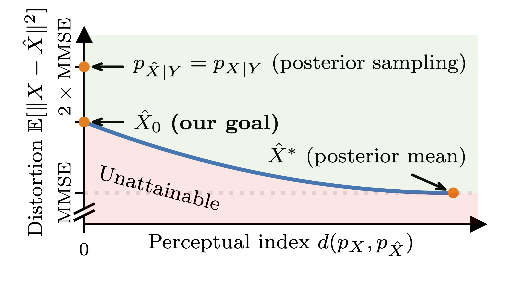

---

##### Links

+ [Paper](https://arxiv.org/abs/2410.00418/)
+ [Project Page](https://pmrf-ml.github.io/)
+ [Code](https://github.com/ohayonguy/PMRF)
+ [Demo](https://huggingface.co/spaces/ohayonguy/PMRF)


---

##### Abstract

Photo-realistic image restoration algorithms are typically evaluated by distortion measures (e.g., PSNR, SSIM) and by perceptual quality measures (e.g., FID, NIQE), where the desire is to attain the lowest possible distortion without compromising on perceptual quality. To achieve this goal, current methods commonly attempt to sample from the posterior distribution, or to optimize a weighted sum of a distortion loss (e.g., MSE) and a perceptual quality loss (e.g., GAN). Unlike previous works, this paper is concerned specifically with the optimal estimator that minimizes the MSE under a constraint of perfect perceptual index, namely where the distribution of the reconstructed images is equal to that of the ground-truth ones. A recent theoretical result shows that such an estimator can be constructed by optimally transporting the posterior mean prediction (MMSE estimate) to the distribution of the ground-truth images. Inspired by this result, we introduce Posterior-Mean Rectified Flow (PMRF), a simple yet highly effective algorithm that approximates this optimal estimator. In particular, PMRF first predicts the posterior mean, and then transports the result to a high-quality image using a rectified flow model that approximates the desired optimal transport map. We investigate the theoretical utility of PMRF and demonstrate that it consistently outperforms previous methods on a variety of image restoration tasks.

---

##### Qualitative illustration of the distortion-perception tradeoff, where distortion is measured by MSE



---

##### Citation

```BibTeX
@inproceedings{
	ohayon2025posteriormean,
	title={Posterior-Mean Rectified Flow: Towards Minimum {MSE} Photo-Realistic Image Restoration},
	author={Guy Ohayon and Tomer Michaeli and Michael Elad},
	booktitle={The Thirteenth International Conference on Learning Representations}, year={2025},
	url={https://openreview.net/forum?id=hPOt3yUXii}
}
```