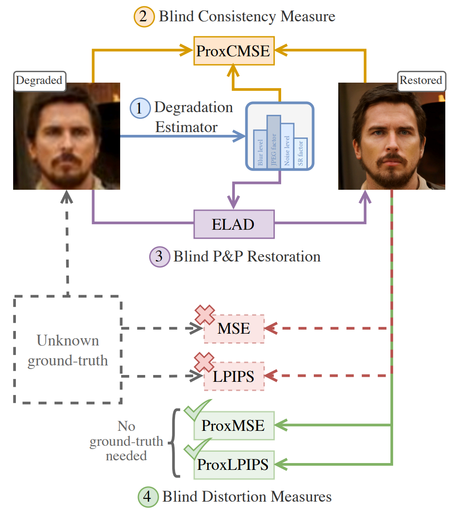

---

##### Links

+ [Paper](https://arxiv.org/abs/2501.12102)
+ [Project Page](https://man-sean.github.io/elad-website/)

---

##### Abstract

Real-world image restoration deals with the recovery of images suffering from an unknown degradation. This task is typically addressed while being given only degraded images, without their corresponding ground-truth versions. In this hard setting, designing and evaluating restoration algorithms becomes highly challenging. This paper offers a suite of tools that can serve both the design and assessment of real-world image restoration algorithms. Our work starts by proposing a trained model that predicts the chain of degradations a given real-world measured input has gone through. We show how this estimator can be used to approximate the consistency – the match between the measurements and any proposed recovered image. We also use this estimator as a guiding force for the design of a simple and highly-effective plug-and-play real-world image restoration algorithm, leveraging a pre-trained diffusion-based image prior. Furthermore, this work proposes no-reference proxy measures of MSE and LPIPS, which, without access to the ground-truth images, allow ranking of real-world image restoration algorithms according to their (approximate) MSE and LPIPS. The proposed suite provides a versatile, first of its kind framework for evaluating and comparing blind image restoration algorithms in real-world scenarios.

---

##### We propose (1) an estimator that predicts the degradations a real-world corrupted measurement has gone through. Using this estimator, we (2) approximate the consistency of any reconstructed candidate with a given input measurement, and use such a measure to develop (3) a plug-and-play real-world restoration algorithm. Moreover, we propose (4) blind (no-reference) measures of distortion that mimic MSE and LPIPS.



---

##### Citation

```BibTeX
@article{man2025proxiesdistortionconsistencyapplications,
  title={Proxies for Distortion and Consistency with Applications for Real-World Image Restoration}, 
  author={Sean Man and Guy Ohayon and Ron Raphaeli and Michael Elad},
  year={2025},
  journal={arXiv preprint arXiv:2501.12102},
  url={https://arxiv.org/abs/2501.12102}, 
}
```