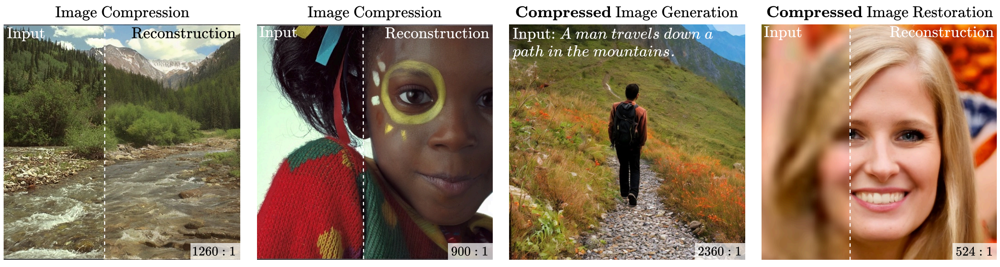

---

##### Links

+ [Paper](https://arxiv.org/abs/2502.01189/)
+ [Project Page](https://ddcm-2025.github.io/)
+ [Code](https://github.com/DDCM-2025/ddcm-compressed-image-generation)
+ [Demo](https://huggingface.co/spaces/DDCM/DDCM)


---

##### Abstract

We present a novel generative approach based on Denoising Diffusion Models (DDMs), which produces high-quality image samples along with their losslessly compressed bit-stream representations. This is obtained by replacing the standard Gaussian noise sampling in the reverse diffusion with a selection of noise samples from pre-defined codebooks of fixed iid Gaussian vectors. Surprisingly, we find that our method, termed Denoising Diffusion Codebook Model (DDCM), retains sample quality and diversity of standard DDMs, even for extremely small codebooks. We leverage DDCM and pick the noises from the codebooks that best match a given image, converting our generative model into a highly effective lossy image codec achieving state-of-the-art perceptual image compression results. More generally, by setting other noise selections rules, we extend our compression method to any conditional image generation task (e.g., image restoration), where the generated images are produced jointly with their condensed bit-stream representations. Our work is accompanied by a mathematical interpretation of the proposed compressed conditional generation schemes, establishing a connection with score-based approximations of posterior samplers for the tasks considered.

---

##### Our proposed scheme (DDCM) produces visually appealing image samples with high compression ratios (bottom-right corners).



---

##### Citation

```BibTeX
@article{ohayon2025compressedimagegenerationdenoising,
	title =   {Compressed Image Generation with Denoising Diffusion Codebook Models},
	author =  {Ohayon, Guy and Manor, Hila and Michaeli, Tomer and Elad, Michael},
	year =    {2025},
	eprint={2502.01189},
	journal={arXiv},
	primaryClass={eess.IV},
	url={https://arxiv.org/abs/2502.01189}, 
}
```